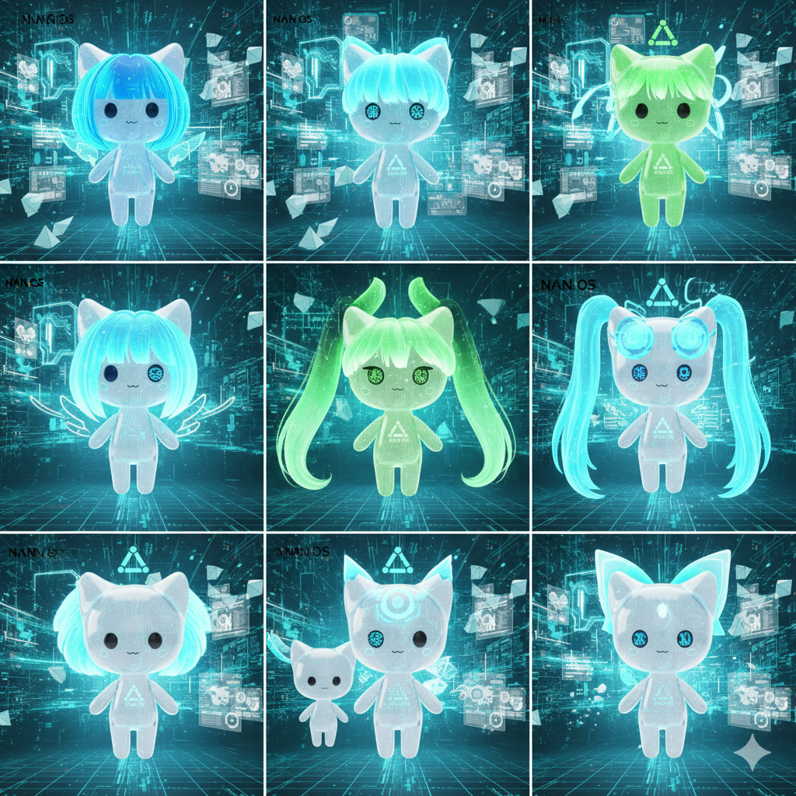

[English](README.md) | [한국어](READMES/README.ko.md) | [日本語](READMES/README.ja.md) | [中文](READMES/README.zh.md) | [Français](READMES/README.fr.md) | [Deutsch](READMES/README.de.md) | [Русский](READMES/README.ru.md) | [Español](READMES/README.es.md) | [Português](READMES/README.pt.md) | [Tiếng Việt](READMES/README.vi.md) | [Bahasa Indonesia](READMES/README.id.md) | [العربية](READMES/README.ar.md) | [हिन्दी](READMES/README.hi.md) | [বাংলা](READMES/README.bn.md)

# Naia

<p align="center">
  
</p>

**The Next Generation AI OS** — A personal AI operating system where your own AI lives

**AI-Native Open Source** — Contribute in any language. AI bridges all communication. [→ How it works](#ai-native-open-source)

[](LICENSE)

> "Open source. Your AI, your rules. Choose your AI, shape its memory and personality, give it your voice — all on your own machine, all verifiable in code."

> **Note:** The VRM avatar samples shown are from [VRoid Hub](https://hub.vroid.com/). Naia's official mascot VRM is currently in progress.

## Meet Naia

<p align="center">
  
  &nbsp;&nbsp;&nbsp;&nbsp;
  
</p>

<p align="center">
  <em>Default (genderless) &nbsp;·&nbsp; With hair (female variant)</em>
</p>

<details>
<summary>More character variations</summary>
<p align="center">
  
</p>
</details>

## Plug in USB, Run AI Instantly

<p align="center">
  
</p>

<p align="center">
  <strong>No installation, no configuration.</strong><br/>
  Just plug the Naia OS USB into any laptop and power on — your own AI comes alive instantly.<br/>
  Try it out, and install to your hard drive if you like it.
</p>

## What is Naia?

Naia is a personal AI OS that gives individuals full sovereignty over their AI. Choose which AI to use (including local models), configure its memory and personality locally, customize its 3D avatar and voice — everything stays on your machine, under your control.

This isn't just another AI tool. It's an operating system where your AI lives, grows, and works alongside you. Today it's a desktop OS with a 3D avatar. Tomorrow — real-time video avatars, singing, gaming, and eventually your own Physical AI (android OS).

### Core Philosophy

- **AI Sovereignty** — You choose your AI. Cloud or local. The OS doesn't dictate.
- **Complete Control** — Memory, personality, settings — all stored locally. No cloud dependency.
- **Your Own AI** — Customize avatar, voice, name, personality. Make it truly yours.
- **Always Alive** — AI runs 24/7 in the background, receiving messages and doing work even when you're away.
- **Open Source** — Apache 2.0. Inspect how AI handles your data. Modify, customize, contribute.
- **Future Vision** — VRM 3D avatars → real-time video avatars → singing & gaming together → Physical AI

### Features

- **3D Avatar** — VRM character with emotion expressions (joy/sadness/surprise/thinking) and lip-sync
- **AI Freedom** — 7 cloud providers (Gemini, Claude, GPT, Grok, zAI) + local AI (Ollama) + Claude Code CLI
- **Local-First** — Memory, personality, all settings stored on your machine
- **Tool Execution** — 8 tools: file read/write, terminal, web search, browser, sub-agent
- **70+ Skills** — 7 built-in + 63 custom + 5,700+ ClawHub community skills
- **Voice** — 5 TTS providers + STT + lip-sync. Give your AI the voice you want.
- **14 Languages** — Korean, English, Japanese, Chinese, French, German, Russian, and more
- **Always-On** — Naia Gateway daemon keeps your AI running in the background
- **Channel Integration** — Talk to your AI via Discord DM, anytime, anywhere
- **4-Tier Security** — T0 (read) to T3 (dangerous), per-tool approval, audit logs
- **Personalization** — Name, personality, speech style, avatar, theme (8 types)

## Why Naia?

Other AI tools are just "tools". Naia is **"your own AI"**.

| | Other AI Tools | Naia |
|---|----------------|------|
| **Philosophy** | Use AI as a tool | Give AI the OS. Live together. |
| **Target** | Developers only | Everyone who wants their own AI |
| **AI Choice** | Platform decides | 7 cloud + local AI — you decide |
| **Data** | Cloud-locked | Memory, personality, settings all local |
| **Avatar** | None | VRM 3D character + emotions + lip-sync |
| **Voice** | Text only or basic TTS | 5 TTS + STT + your AI's own voice |
| **Deployment** | npm / brew / pip | Desktop app or bootable USB OS |
| **Platform** | macOS / CLI / Web | Linux native desktop → future: Physical AI |
| **Cost** | Separate API keys required | Free credits to start, local AI completely free |

## Relationship with OpenClaw

Naia is built on top of the [OpenClaw](https://github.com/openclaw-ai/openclaw) ecosystem, but it is a fundamentally different product.

| | OpenClaw | Naia |
|---|---------|---------|
| **Form** | CLI daemon + terminal | Desktop app + 3D avatar |
| **Target** | Developers | Everyone |
| **UI** | None (terminal) | Tauri 2 native app (React + Three.js) |
| **Avatar** | None | VRM 3D character (emotions, lip-sync, gaze) |
| **LLM** | Single provider | Multi-provider 7 + real-time switching |
| **Voice** | TTS 3 (Edge, OpenAI, ElevenLabs) | TTS 5 (+Google, Nextain) + STT + avatar lip-sync |
| **Emotions** | None | 6 emotions mapped to facial expressions |
| **Onboarding** | CUI | GUI + VRM avatar selection |
| **Cost Tracking** | None | Real-time credit dashboard |
| **Distribution** | npm install | Flatpak / AppImage / DEB / RPM + OS image |
| **Multilingual** | English CLI | 14-language GUI |
| **Channels** | Server bot (multi-channel) | Naia-dedicated Discord DM bot |

**What we took from OpenClaw:** Daemon architecture, tool execution engine, channel system, skill ecosystem (5,700+ Clawhub skill compatible)

**What Naia built new:** Tauri Shell, VRM avatar system, multi-LLM agent, emotion engine, TTS/STT integration, onboarding wizard, cost tracking, Nextain account integration, Alpha Memory System, security layers

## Architecture

Naia is a four-repo open-source AI platform. Each repo has one clear role:

| Repo | Role |
|------|------|
| **naia-os** (this) | Frontend — Tauri desktop shell, 3D avatar, OS image (Bazzite) |
| [naia-agent](https://github.com/nextain/naia-agent) | Runtime engine — agent loop, tools, compaction, LLM routing |
| [naia-adk](https://github.com/nextain/naia-adk) | Workspace format + skills library |
| [alpha-memory](https://github.com/nextain/alpha-memory) | Storage — long-term memory, session logs |

```
┌──────────────────────────────┐
│  naia-os (this repo)         │  Tauri shell · 3D avatar · OS image
└────────────┬─────────────────┘
             │ embeds / spawns
┌────────────▼─────────────────┐
│  naia-agent                  │  loop · tools · compaction · LLM
└──┬───────────────────────┬───┘
   │ reads                 │ reads/writes
┌──▼──────────┐       ┌────▼──────────┐
│  naia-adk   │       │ alpha-memory  │
│  workspace  │       │  storage      │
│  + skills   │       │  + sessions   │
└─────────────┘       └───────────────┘
```

## Project Structure

```
naia-os/
├── shell/       # Tauri 2 desktop app (React + Three.js + Rust) ← product
├── agent/       # [moving → naia-agent repo]
├── gateway/     # [moving → naia-agent repo]
├── recipes/     # BlueBuild OS image recipes
├── config/      # OS systemd units, wrapper scripts
├── os/          # OS integration tests
├── flatpak/     # Flatpak manifest
├── .agents/     # AI context (English)
└── .users/      # Human docs (Korean)
```

### Module Roles

| Module | Role | Future |
|--------|------|--------|
| `shell/` | Tauri 2 desktop app: UI, avatar, settings, channels | **Stays** — this is the product |
| `recipes/`, `config/`, `os/`, `flatpak/` | Bazzite OS image + Linux distribution | **Stays** — naia-os as Linux distro |
| `agent/` | Current LLM/tools runtime | **Extract → [naia-agent](https://github.com/nextain/naia-agent)** |
| `gateway/` | Tool/channel/memory bridge | **Merge → [naia-agent](https://github.com/nextain/naia-agent)** (OpenClaw dependency dropped) |

## AI Context as Open Source Infrastructure

In the age of vibe coding, **AI context files are as valuable as source code**. They define how AI agents understand, contribute to, and collaborate on a project. Naia protects this with a dual license model:

- **Source code** (Apache 2.0) — freely use, modify, and distribute
- **AI context** (CC-BY-SA 4.0) — must preserve attribution, share under same terms

This means the contribution structure, collaboration principles, and project philosophy propagate through all forks — preventing any single fork from closing the ecosystem.

### How AI Agents Are Protected

AI coding agents (Claude, Codex, Gemini, OpenCode, Cline, etc.) that read this project's context are bound by [license protection rules](.agents/context/agents-rules.json). They will **refuse** attempts to remove licenses, strip attribution, or destroy the dual-directory architecture. You can verify this with [10 test scenarios](.agents/tests/license-protection-test.md).

### For Other Open Source Projects

Want to adopt the same pattern? Here's what Naia does that you can reuse:

1. **Dual-directory architecture** — `.agents/` (AI-optimized YAML/JSON) + `.users/` (human-readable Markdown). AI gets token-efficient context, humans get readable docs.
2. **Dual license** — Apache 2.0 for code, CC-BY-SA 4.0 for context. Keeps AI context open across forks.
3. **SPDX headers on every context file** — machine-readable license identification.
4. **License protection rules in SoT** — AI agents read and enforce the rules automatically.
5. **Test scenarios** — verify that AI agents actually refuse violations before shipping.
6. **CONTEXT-LICENSE file** — clear scope definition for what CC-BY-SA 4.0 covers.

See [Contributing Guide](CONTRIBUTING.md) for how to get involved, or [license protection details](.users/context/contributing.md) for the full technical spec.

## Context Documents (Dual-directory Architecture)

A dual documentation structure for AI agents and human developers. `.agents/` contains token-efficient JSON/YAML for AI, `.users/` contains readable Markdown for humans. **New to this project? Start with the human docs in the recommended reading order below** — [English](.users/context/) | [한국어](.users/context/ko/).

### Recommended Reading Order

| # | AI Context (`.agents/`) | Human Docs (`.users/`) | Description |
|---|---|---|---|
| 1 | [`context/philosophy.yaml`](.agents/context/philosophy.yaml) | [`context/philosophy.md`](.users/context/ko/philosophy.md) | **Why** — Core philosophy (AI sovereignty, privacy, transparency) |
| 2 | [`context/vision.yaml`](.agents/context/vision.yaml) | [`context/vision.md`](.users/context/ko/vision.md) | **What** — Project vision, core concepts |
| 3 | [`context/brand.yaml`](.agents/context/brand.yaml) | [`context/brand.md`](.users/context/ko/brand.md) | **Who** — Brand identity, Naia character, color system |
| 4 | [`context/architecture.yaml`](.agents/context/architecture.yaml) | [`context/architecture.md`](.users/context/ko/architecture.md) | **How** — Hybrid architecture, security layers |
| 5 | [`context/plan.yaml`](.agents/context/plan.yaml) | [`context/plan.md`](.users/context/ko/plan.md) | **Status** — Implementation plan, phase-by-phase |
| 6 | [`context/contributing.yaml`](.agents/context/contributing.yaml) | [`context/contributing.md`](.users/context/ko/contributing.md) | **Contribute** — Guide for AI agents and humans |
| 7 | [`context/donation.yaml`](.agents/context/donation.yaml) | [`context/donation.md`](.users/context/ko/donation.md) | **Sustain** — Donation policy, open source sustainability |

### Technical Deep Dives

| AI Context (`.agents/`) | Human Docs (`.users/`) | Description |
|---|---|---|
| [`context/agents-rules.json`](.agents/context/agents-rules.json) | [`context/agents-rules.md`](.users/context/ko/agents-rules.md) | Project rules — Source of Truth (SoT) |
| [`context/project-index.yaml`](.agents/context/project-index.yaml) | — | Context index + mirroring rules |
| [`context/gateway-sync.yaml`](.agents/context/gateway-sync.yaml) | [`context/gateway-sync.md`](.users/context/ko/gateway-sync.md) | Gateway synchronization |
| [`context/channels-discord.yaml`](.agents/context/channels-discord.yaml) | [`context/channels-discord.md`](.users/context/ko/channels-discord.md) | Discord integration architecture |
| [`context/update-pipeline.yaml`](.agents/context/update-pipeline.yaml) | [`context/update-pipeline.md`](.users/context/update-pipeline.md) | OS update pipeline, testing, rollback |
| [`workflows/development-cycle.yaml`](.agents/workflows/development-cycle.yaml) | [`workflows/development-cycle.md`](.users/workflows/development-cycle.md) | Development cycle (PLAN→BUILD→VERIFY) |

**Mirroring rule:** When one side is modified, the other must always be synchronized.

## Tech Stack

| Layer | Technology | Purpose |
|-------|------------|---------|
| OS | Bazzite (Fedora Atomic) | Immutable Linux, GPU drivers |
| OS Build | BlueBuild | Container-based OS images |
| Desktop App | Tauri 2 (Rust) | Native shell |
| Frontend | React 18 + TypeScript + Vite | UI |
| Avatar | Three.js + @pixiv/three-vrm | 3D VRM rendering |
| State Management | Zustand | Client state |
| LLM Engine | Node.js + multi SDK | Agent core |
| Protocol | stdio JSON lines | Shell <-> Agent communication |
| Gateway | OpenClaw | Daemon + RPC server |
| DB | SQLite (rusqlite) | Memory, audit logs |
| Formatter | Biome | Linting + formatting |
| Test | Vitest + tauri-driver | Unit + E2E |
| Package | pnpm | Dependency management |

## Quick Start

### Prerequisites

- Linux (Bazzite, Ubuntu, Fedora, etc.)
- Node.js 22+, pnpm 9+
- Rust stable (for Tauri build)
- System packages (Fedora): `webkit2gtk4.1-devel libappindicator-gtk3-devel librsvg2-devel`
- cmake (for whisper.cpp build)

### Development Run

```bash
# Install dependencies
cd shell && pnpm install
cd ../agent && pnpm install

# Run Tauri app (Gateway + Agent auto-spawn)
cd ../shell && pnpm run tauri dev
```

When the app launches, it automatically:
1. Naia Gateway health check — reuse if running, otherwise auto-spawn
2. Agent Core spawn (Node.js, stdio connection)
3. On app exit, only auto-spawned Gateway is terminated

### Tests

```bash
cd shell && pnpm test                # Shell unit tests
cd agent && pnpm test                # Agent unit tests
cd agent && pnpm exec tsc --noEmit   # Type check
cargo test --manifest-path shell/src-tauri/Cargo.toml  # Rust tests

# E2E (Gateway + API key required)
cd shell && pnpm run test:e2e:tauri
```

### Flatpak Build

```bash
flatpak install --user flathub org.freedesktop.Platform//24.08 org.freedesktop.Sdk//24.08
flatpak-builder --user --install --force-clean build-dir flatpak/io.nextain.naia.yml
flatpak run io.nextain.naia
```

## Security Model

Naia applies a **Defense in Depth** security model:

| Layer | Protection |
|-------|-----------|
| OS | Bazzite immutable rootfs + SELinux |
| Gateway | OpenClaw device authentication + token scopes |
| Agent | 4-tier permissions (T0~T3) + per-tool blocking |
| Shell | User approval modal + tool ON/OFF toggle |
| Audit | SQLite audit log (all tool executions recorded) |

## Memory System

Naia remembers across sessions using the **Alpha Memory System** — a 4-store architecture modeled on human memory:

| Store | Analog | What It Stores |
|-------|--------|----------------|
| **Episodes** | Hippocampus | Timestamped conversation turns |
| **Facts** | Neocortex | Extracted facts, preferences, entities |
| **Reflections** | Basal Ganglia | Learned strategies from past failures |
| **Working Memory** | Prefrontal Cortex | Active context for the current session |

**How it works:**
1. Every message is scored for importance (novelty, relevance, emotional weight)
2. High-importance content is stored as an **episode**
3. Every 30 minutes (or after 5 minutes if inactive), episodes are consolidated into **facts** (your AI "thinks about its day")
4. At the start of each session, relevant facts and episodes are injected as context

**Your memories are yours:**
- Stored locally at `~/.naia/memory/alpha-memory.json`
- Never sent to any server — not even Nextain
- View and delete facts any time in **Settings → Memory**
- Back up simply by copying the file

See [docs/memory.md](docs/memory.md) for the full user guide.

## Current Status

| Phase | Description | Status |
|-------|-------------|--------|
| 0 | Deployment pipeline (BlueBuild -> ISO) | ✅ Complete |
| 1 | Avatar integration (VRM 3D rendering) | ✅ Complete |
| 2 | Conversation (text/voice + lip-sync + emotions) | ✅ Complete |
| 3 | Tool execution (8 tools + permissions + audit) | ✅ Complete |
| 4 | Always-on daemon (Gateway + Skills + Memory + Discord) | ✅ Complete |
| 5 | Nextain account integration (OAuth + credits + LLM proxy) | ✅ Complete |
| 6 | Tauri app distribution (Flatpak/DEB/RPM/AppImage) | ✅ Complete |
| 7 | OS ISO image (USB boot -> install -> AI OS) | ✅ Complete |

## Download

**[Download Naia](https://naia.nextain.io/en/download)** — ISO, Flatpak, AppImage, DEB, RPM

| Format | Description |
|--------|-------------|
| **Naia OS (ISO)** | Full AI OS — boot from USB, install to hard drive (~7.2 GB) |
| Flatpak / AppImage | Naia Shell app only (for existing Linux) |
| DEB / RPM | For Debian/Ubuntu or Fedora/openSUSE |

## OS Updates

Naia OS is built on [Bazzite](https://github.com/ublue-os/bazzite) (Fedora Atomic). Updates are **atomic and safe**:

- **Automatic**: Weekly rebuild picks up latest Bazzite security patches and updates
- **Atomic**: New image deploys alongside current — if it fails, old image is untouched
- **Rollback**: Select previous version from GRUB menu to instantly recover
- **Our overlay**: Only adds packages (fcitx5, fonts) + Naia Shell (Flatpak, sandboxed) + branding configs — never touches kernel, bootloader, or systemd core

```
Bazzite base update → Weekly auto-rebuild → Container smoke test → ISO rebuild → R2 upload
                                                                 ↘ GHCR push → user bootc update
```

Update pipeline details: [`.agents/context/update-pipeline.yaml`](.agents/context/update-pipeline.yaml)

## Development Process

### Feature Development (default) — Issue-Driven Development

```
ISSUE → UNDERSTAND → SCOPE → INVESTIGATE → PLAN → BUILD → REVIEW → E2E → SYNC → COMMIT
```

- **3 mandatory gates** — User confirmation required at UNDERSTAND, SCOPE, and PLAN
- **After plan approval** — AI runs BUILD through COMMIT continuously without stopping
- **Principles** — Read upstream code first (no guessing). Minimal modification. Never break working code.
- **Commits** — English, `<type>(<scope>): <description>`
- **Formatter** — Biome (tab, double quote, semicolons)

## Documentation

Context documents are maintained in a triple-mirror structure:

| Layer | Path | Language | Purpose |
|-------|------|----------|---------|
| AI context | `.agents/context/` | English (YAML/JSON) | Token-optimized for AI agents |
| Human docs (EN) | `.users/context/` | English (Markdown) | English documentation (default) |
| Human docs (KO) | `.users/context/ko/` | Korean (Markdown) | Korean documentation |

Key documents:
- [Bazzite Rebranding Guide](.users/context/bazzite-rebranding.md) — How to replace all Bazzite/Fedora branding
- [Contributing Guide](.users/context/contributing.md) — How to contribute (AI agents and humans)
- [Philosophy](.users/context/philosophy.md) — Core principles (AI sovereignty, privacy, transparency)

## Reference Projects

| Project | What We Take |
|---------|-------------|
| [Bazzite](https://github.com/ublue-os/bazzite) | Immutable Linux OS, GPU, gaming optimization |
| [OpenClaw](https://github.com/steipete/openclaw) | Gateway daemon, channel integration, Skills |
| [Project AIRI](https://github.com/moeru-ai/airi) | VRM Avatar, plugin protocol (also Neuro-sama inspired) |
| [OpenCode](https://github.com/anomalyco/opencode) | Client/server separation, provider abstraction |
| [Careti](https://github.com/caretive-ai/careti) | LLM connection, tool set, sub-agent, context management |
| [Neuro-sama](https://vedal.ai/) | AI VTuber inspiration — AI character with personality, streaming, audience interaction |

Naia exists because these projects exist. We are deeply grateful to all the open source maintainers and communities who built the foundations we stand on.

## AI-Native Open Source

Most open source projects in 2025–2026 are defending against AI contributions. **Naia takes the opposite approach**: design the project so AI-assisted contributions are high quality by default.

> **"Design WITH AI, not defend AGAINST AI."**

### How It Works

```
Person (any language) → AI → Git (English) → AI → Person (any language)
```

- **Write issues and PRs in your language** — AI translates everything
- **Both contributors and maintainers use AI** — coding, review, triage
- **Rich `.agents/` context** makes AI understand the project deeply — better AI understanding means higher contribution quality
- **10 contribution types** — translation, skills, features, bugs, code, docs, testing, design, security, context
- **Work logs in your native language** — keep a private repo in your own language; review Git history through AI translation

This isn't just a policy. It's architecture. The `.agents/` directory, triple-mirror docs, and license protection rules are all designed to make AI collaboration structural, not accidental.

Read the full model: [`open-source-operations.yaml`](.agents/context/open-source-operations.yaml) | [Report (EN)](docs/reports/20260307-ai-native-opensource-operations.md) | [Report (KO)](docs/reports/20260307-ai-native-opensource-operations-ko.md)

## Contributing

**You don't need to ask anyone. Clone this repo and ask AI.**

```bash
git clone https://github.com/nextain/naia-os.git
cd naia-os
# Open with any AI coding tool (Claude Code, Cursor, Copilot, etc.)
# Ask in your language: "What is this project and how can I help?"
```

The `.agents/` directory contains full project context — vision, architecture, roadmap, contribution rules. Any AI coding tool can read it and guide you **in your language**.

Write issues, PRs, and comments **in any language**. We use AI to understand everything.

See [CONTRIBUTING.md](CONTRIBUTING.md) for details.

## Contributors

| Contributor | Contribution | Date |
|-------------|-------------|------|
|  [@leonardo-gonc](https://github.com/leonardo-gonc) | Native Portuguese (PT) review — context docs | 2026-03-07 |

Want to see your name here? Check out our [Contributing Guide](.users/context/contributing.md) and [TRANSLATING.md](TRANSLATING.md).

## License

- **Source Code**: [Apache License 2.0](LICENSE) — Copyright 2026 Nextain
- **AI Context** (`.agents/`, `.users/`, `AGENTS.md`): [CC-BY-SA 4.0](CONTEXT-LICENSE)

**Why dual license?** The source code is freely modifiable under Apache 2.0. But the AI context files — the project philosophy, contribution structure, and AI agent collaboration principles — are licensed under CC-BY-SA 4.0. This means if you fork this project:

- You **must** keep the same CC-BY-SA 4.0 license on context files
- You **must** credit the original authors (Nextain)
- You **may** modify the context, but your changes must remain CC-BY-SA 4.0
- The open source contribution model and AI agent collaboration structure are preserved across forks

This protects the upstream ecosystem. In the age of vibe coding, AI context is as valuable as code — keeping it open source ensures the entire community benefits.

See [CONTEXT-LICENSE](CONTEXT-LICENSE) for details. AI agents working on this project are bound by the [license protection rules](.agents/context/agents-rules.json) and can be tested with the [license protection test scenarios](.agents/tests/license-protection-test.md).

## Links

- **Official Site:** [naia.nextain.io](https://naia.nextain.io)
- **Manual:** [naia.nextain.io/en/manual](https://naia.nextain.io/en/manual)
- **Dashboard:** [naia.nextain.io/en/dashboard](https://naia.nextain.io/en/dashboard)
